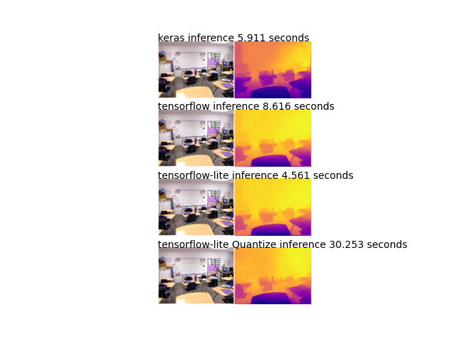
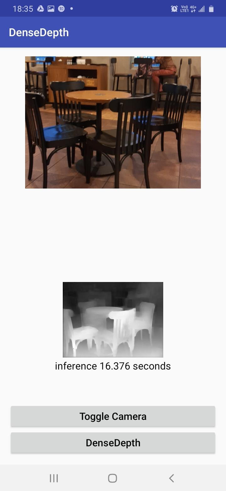

Modify from [DenseDepth](https://github.com/ialhashim/DenseDepth) and [Android Object Detection](https://github.com/amitshekhariitbhu/Android-TensorFlow-Lite-Example)  
## Main Contributions:
 1. Porting source from tensorflow1.x to tensorflow2.2
 2. Convert pre-trained keras model(.h5) to tensorflow2.2(.pb) and tensorflow-lite(.tflite)
 3. Android app with the tensorflow-lite quantized model  
 
 Difficulties in tflite convertion:
 1. The keras model can't be loaded from TFLiteConverter.from_keras_model() because custom_objects parsing isn't supported
 2. The keras model can't be loaded from TFLiteConverter.from_saved_model() because dynamic input shape [NONE, NONE, NONE, NONE] is not supported  
 
 Solution Steps:  
 1. After loading .pb, converting its input shape to fixed shape [1, 480, 640, 3] in the session graph. 
 2. Resave .pb from session graph. (Very improtant! converting and inferring directly without resave won't succeed...)
 3. Load .pb again for inference.
## Results
* Comparision of Keras, Tensorflow2.2 and Tensorflow-lite model over NYU Depth V2
  

## Requirements
* Install Tensorflow 2.2, python3.6
* Download and put [cudart64_101.dll](https://www.dll-files.com/cudart64_101.dll.html)
under your cuda bin directory (ex: C:\Program Files\NVIDIA GPU Computing Toolkit\CUDA\v9.0\bin)
* Download [Keras model](https://s3-eu-west-1.amazonaws.com/densedepth/nyu.h5) based on NYU Depth V2 and put it under the project

## Converted Models
Over NYU Depth V2
* [Tensorflow2.2](https://drive.google.com/file/d/13sKXHxPJsI6sxV82D56l5r407EV6un8F/view?usp=sharing) (162 MB)
* [Tensorflow-lite](https://drive.google.com/file/d/1suZAhRvRtyok7aWtGIqgGZf0zBJQ4Kdj/view?usp=sharing) (162 MB)
* [Tensorflow-lite quantized](https://drive.google.com/file/d/1eO_GJz8G9iMfRcipkPb9MtZjtl5Oi13A/view?usp=sharing) (41 MB)

## Run Demo
After download and put the pre-trained keras model(nyu.h5) in the project
1. Run `python convert.py`. to generate tensorflow2.2 and lite models with its corresponding depth map.
2. Rename nyuQuan.tflite with nyu.tflite and put it on Android/app/src/main/assets
3. Build and run Android with android studio  

you can also download and install [DenseDepth apk](https://drive.google.com/file/d/1JIy9Rfcvc7W7P6uhJg2gdFKgakH12JJU/view?usp=sharing) with the Tensorflow-lite quantized model
## Reference
Thanks for the authors. If using the code, please cite their paper:
```
@article{Alhashim2018,
  author    = {Ibraheem Alhashim and Peter Wonka},
  title     = {High Quality Monocular Depth Estimation via Transfer Learning},
  journal   = {arXiv e-prints},
  volume    = {abs/1812.11941},
  year      = {2018},
  url       = {https://arxiv.org/abs/1812.11941},
  eid       = {arXiv:1812.11941},
  eprint    = {1812.11941}
}
```
